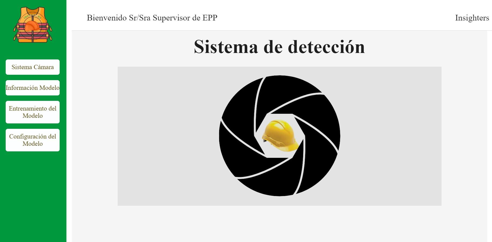

# Sistema de Detección de Incumplimiento del Uso de EPP (Cascos) con YOLOv8

Este sistema realiza la detección automatizada del uso adecuado del equipo de protección personal (EPP), específicamente cascos de seguridad, en entornos controlados. Utiliza modelos de visión por computadora basados en YOLOv8 para procesar transmisiones de video en tiempo real y genera alertas sonoras en caso de detectar incumplimientos.

La arquitectura del sistema está desarrollada en Python, con una interfaz web construida sobre Flask como framework backend, permitiendo una integración sencilla y visualización directa desde navegador.

## 🚀 Tecnologías
- Python
- Flask
- YOLOv8
- OpenCV
- PyTorch

## 🖥️ Capturas del sistema


## 🛠️ Cómo usar

Descargar sistema: 
https://drive.google.com/drive/folders/1tAfOT6fbvR71OgotS75aYkRQpi6CU-cY?usp=sharing

1. Instalación de dependencias del entorno:
Desde la carpeta raíz del proyecto descargado, ejecuta el siguiente comando para instalar todas las dependencias necesarias especificadas en requirements.txt:

```bash
pip install -r requirements.txt
```


🔹 Se recomienda realizar esta instalación dentro de un entorno virtual (por ejemplo, venv) para evitar conflictos con otros entornos de desarrollo.

